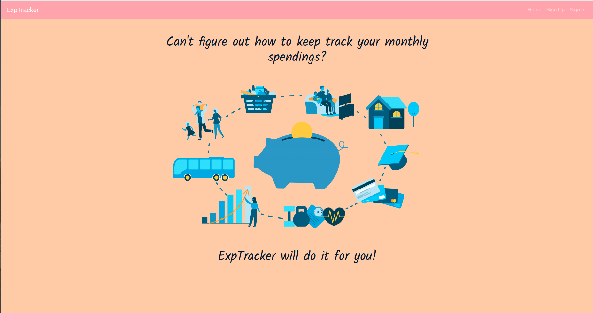

# ExpTracker

`ExpTracker` is designed to keep track of your expenses. All expenses are divided by 10 categories. Users can add new transactions to existing categories. Every transaction has information about the date when transaction was made, its amount and brief description. App displays the total amount for each group of transactions. Users also can get the information about monthly expenses. It helps to efficiently analyze what percentage of your total expenses each category represents.

## Important links

* `ExpTracker` API repo: https://github.com/tinatimkova/expenses-tracker-rails-api
* `ExpTracker`client deployed: https://tinatimkova.github.io/expenses-tracker-client/
* `ExpTracker` API deployed: https://quiet-reaches-54498.herokuapp.com/

## List of technologies used
1. React
2. JSX
3. Axios
4. NPM
5. React Bootstrap

## Wireframes and user stories

### User stories
1. As a user, I would like to be able to sign up and sign in using email and a password.
2. An authorized user should be able to see the list of expenses (categories).
3. As an authorized user I want to be able to click on individual category and see all transactions that belong to it.
4. As an authorized user I'd like to be able to delete or edit transactions.
5. As an authorized user I can add new transactions to existing categories of expenses.
6. As an authorized user I'd love to be able to change password.
7. As an authorized user I'd like to be able to sign out.

### Wireframes

## Planning

When working on the project I followed the plan described below:
* write user stories
* draw wireframes
* draw ERD
* set up development environment
* create project API
* develop front-end
* add styling
* write documentation

## Development process and problem solving

I used Ruby on Rails to built the API for my application. The choice of the framework was dictated by my preference to work with SQL database. In addition to `User resource` I created two others - `Categories` and `Transactions`. `Categories` table is not related to `Users` while it has one-to-many relationship with `Transactions` resource. For this full-stack project I used MVC design pattern.
The front-end was developed with React. This framework gives us a useful toolset that make the development process smoother. Components can be shared by different parts of application. They keep your code modularized, easy to read and maintain. In `ExpTracker` I also utilized React bootstrap to create attractive user interface design.

## List of unsolved problems
In order to improve my app I'm planning to add the graphic representation of data. There're many libraries available for creating charts in React.
Another stretch goal is to make it possible for users to modify existing categories of transactions.
In addition, I'd like to reorganize routes for the front-end to make it easier for users to navigate between the components.
