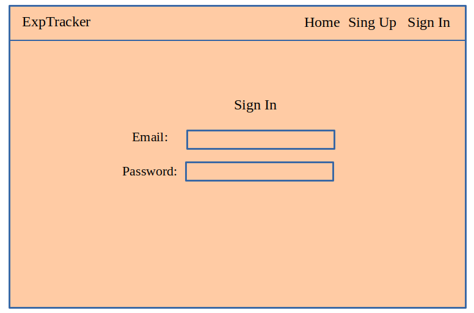
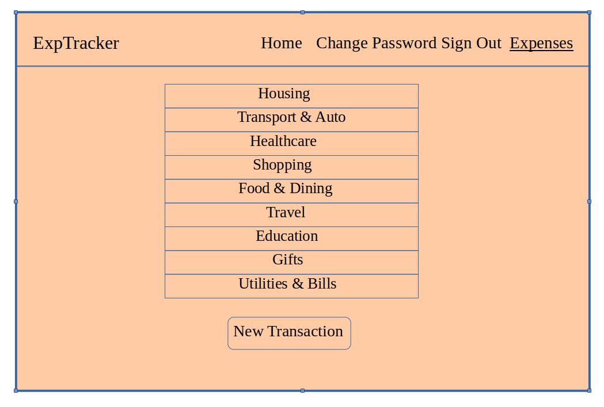
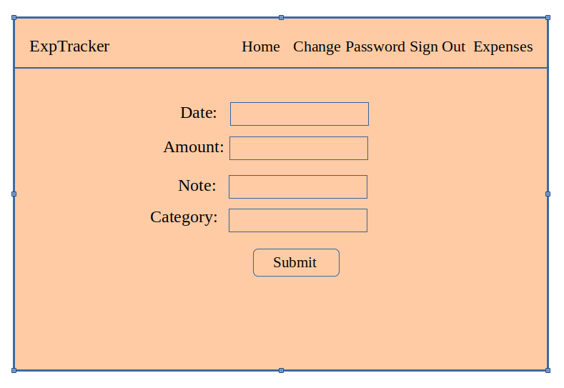
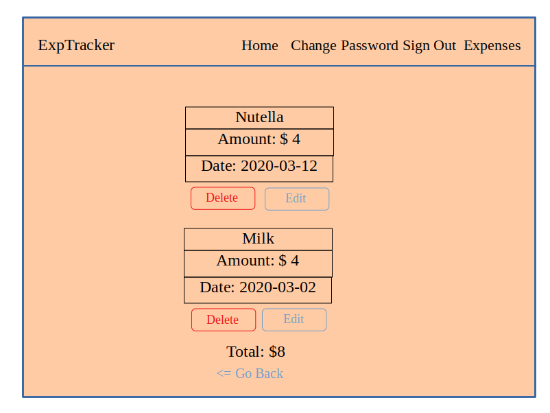

# ExpTracker

`ExpTracker`

## Important links

* `ExpTracker` API repo: https://github.com/tinatimkova/expenses-tracker-rails-api
* `ExpTracker`client deployed: https://tinatimkova.github.io/expenses-tracker-client/
* `ExpTracker` API deployed: https://quiet-reaches-54498.herokuapp.com/

## List of technologies used
1. React
2. JSX
3. Axios
4. NPM
5. React Bootstrap

## Wireframes and user stories

### User stories
1. As a user, I would like to be able to sign up and sign in using email and a password.
2. An authorized user should be able to see the list of expenses (categories).
3. As an authorized user I want to be able to click on individual category and see all transactions that belong to it.
4. As an authorized user I'd like to be able to delete or edit transactions.
5. As an authorized user I can add new transactions to existing categories of expenses.
6. As an authorized user I'd love to be able to change password.
7. As an authorized user I'd like to be able to sign out.

### Wireframes

## Planning

When working on the project I followed the plan described below:
* write user stories
* draw wireframes
* draw ERD
* set up development environment
* create project API
* develop front-end
* add styling
* write documentation

## Development process and problem solving

## List of unsolved problems
